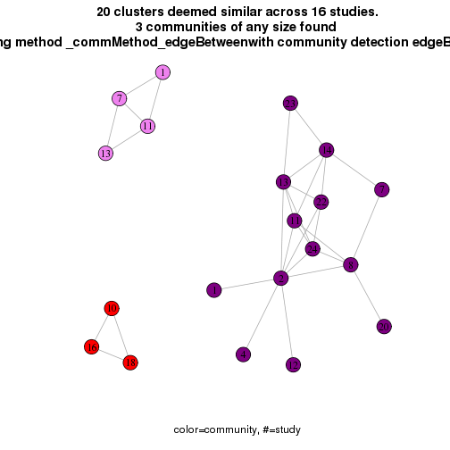
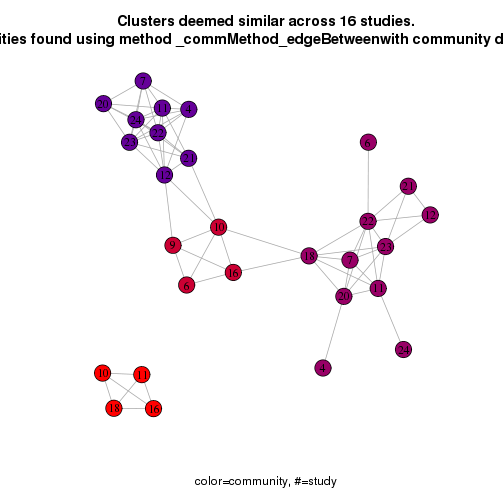
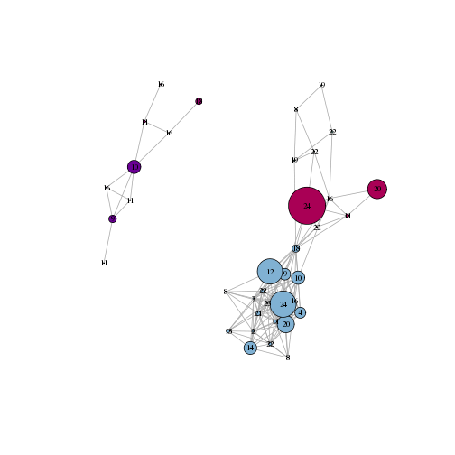
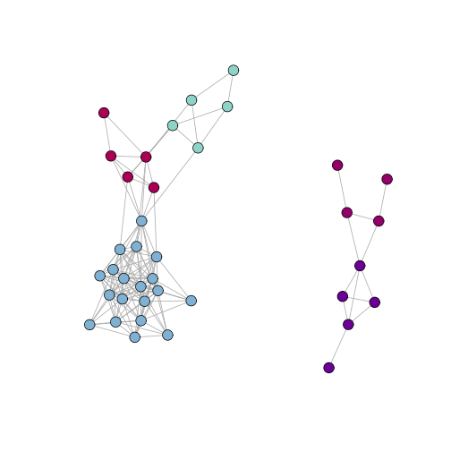
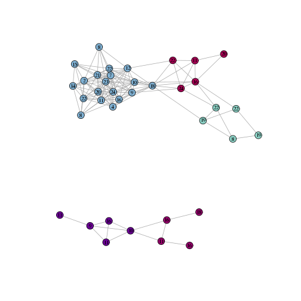
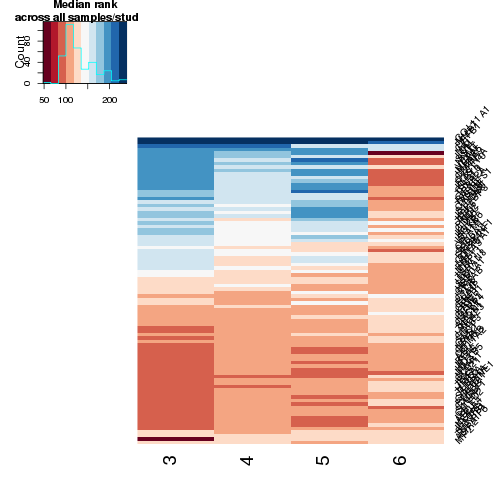

curatedOvarianData meta-clustering with 500 (meta-rank) features using kmeans consensus and pearson mean matrix correlation
========================================================
**Data loading**


This is a report for the curatedOvarianData meta-clustering. Initial clustering was done using k-means and selecting k via the the rounded PACR metric with nstart=1.

First, I loaded up my data just past the CoINcIDE" "getAdjMatrices() function (that's the function that takes  a really long time to run and is hogging up server space, as this is the part that computes the edge p-values):


```
## Loading required package: BiocGenerics
## Loading required package: parallel
## 
## Attaching package: 'BiocGenerics'
## 
## The following objects are masked from 'package:parallel':
## 
##     clusterApply, clusterApplyLB, clusterCall, clusterEvalQ,
##     clusterExport, clusterMap, parApply, parCapply, parLapply,
##     parLapplyLB, parRapply, parSapply, parSapplyLB
## 
## The following object is masked from 'package:stats':
## 
##     xtabs
## 
## The following objects are masked from 'package:base':
## 
##     Filter, Find, Map, Position, Reduce, anyDuplicated, append,
##     as.data.frame, as.vector, cbind, colnames, do.call,
##     duplicated, eval, evalq, get, intersect, is.unsorted, lapply,
##     mapply, match, mget, order, paste, pmax, pmax.int, pmin,
##     pmin.int, rank, rbind, rep.int, rownames, sapply, setdiff,
##     sort, table, tapply, union, unique, unlist
## 
## Welcome to Bioconductor
## 
##     Vignettes contain introductory material; view with
##     'browseVignettes()'. To cite Bioconductor, see
##     'citation("Biobase")', and for packages 'citation("pkgname")'.
## 
## 
## Attaching package: 'limma'
## 
## The following object is masked from 'package:BiocGenerics':
## 
##     plotMA
## 
## 
## Attaching package: 'gplots'
## 
## The following object is masked from 'package:stats':
## 
##     lowess
## 
## Loading required package: annotate
## Loading required package: AnnotationDbi
## Loading required package: GenomeInfoDb
## Loading required package: graph
## 
## Attaching package: 'graph'
## 
## The following objects are masked from 'package:igraph':
## 
##     degree, edges
## 
## 
## Attaching package: 'plyr'
## 
## The following object is masked from 'package:graph':
## 
##     join
## 
## Loading required package: bitops
## Loading required package: GOstats
## Loading required package: Category
## Loading required package: Matrix
## 
## Attaching package: 'Matrix'
## 
## The following objects are masked from 'package:base':
## 
##     crossprod, tcrossprod
## 
## Loading required package: GO.db
## Loading required package: DBI
## 
## 
## Attaching package: 'GOstats'
## 
## The following object is masked from 'package:AnnotationDbi':
## 
##     makeGOGraph
## 
## 
## Attaching package: 'RDAVIDWebService'
## 
## The following object is masked from 'package:GSEABase':
## 
##     ids
## 
## The following object is masked from 'package:AnnotationDbi':
## 
##     species
## 
## The following objects are masked from 'package:igraph':
## 
##     is.connected, membership
## 
## The following object is masked from 'package:BiocGenerics':
## 
##     counts
```

**Input variables used to derive adjacency matrix**


```
## Input variables used to derive the adjacency matrix:
```

```
##                  date edgeMethod numParallelCores minTrueSimilThresh
## 1 2015-04-29 07:06:47    pearson                3                0.3
##   maxTrueSimilThresh  sigMethod maxNullFractSize numSims
## 1                Inf meanMatrix              0.2     500
##   includeRefClustInNull fractFeatIntersectThresh numFeatIntersectThresh
## 1                  TRUE                      0.8                    425
##   clustSizeThresh clustSizeFractThresh
## 1               5                 0.05
```

```
## There were 74 total input clusters from 23 studies
## The total number of input features was 527
## Across the entire square (nonsymmetric) p-value matrix, there are 1114 pvalues less than or equal to .1
## Across the entire square (nonsymmetric) p-value matrix, there are 1018 pvalues less than or equal to .05
## Across the entire square (symmetric) similarity matrix, there are 1462 similarities greater than or equal to 0.5
```

**Network Analysis**

As we can see in these plots, 4 meta-clusters remained after edge filtering. 

```
## 17 clusters dropped because they were below the clust size thresh clustSizeThresh
##           threshold of 5
## A total of 33 clusters removed because they have no significant edges.
## A total of 41 clusters have significant edges.
```

      

```
## Overall network stats (I believe the origNumClusters variable may be off-need to debug:
```

```
##  numCommunities     numClusters origNumClusters        numEdges 
##               4              37              37             149 
##      numStudies 
##              18
```

**Gene meta-rank Analysis**


I ranked genes within each meta-cluster for all samples, and then ran a Kruskal test to see which genes significantly stratified/differentiated patients across the 4 meta-clusters. I still need to implement GSEA; it turns out there's a base GSEA package in Biocondcutor so I've decided to just adapt my code and use their baseline functions.


In the heatmap: red means that gene was ranked high in terms of expression level for patients in that meta-cluster (I took the median rank across all samples in a meta-cluster to create the heatmap. Only significant genes are shown in the heatmap but at over 80 significant genes, of course the gene names are illegible...I print out the top 20 genes below.) The actual meta-cluster numbers are not 1:4 because meta-clusters with only 2 studies were thresholded out earlier.


```
## There are 157 genes with an FDR corrected p-value below .05 whose ranks significantly differed among all of the meta-clusters (using Kruskal's test)
## Red in heatmap means genes were ranked higher across all samples in that meta-cluster.
```

 

```
## Running effect size analysis:
```

```
## Error in colnames(computeMetaclustEffectSizesOutput$summWilcoxon_qvalue): error in evaluating the argument 'x' in selecting a method for function 'colnames': Error: object 'computeMetaclustEffectSizesOutput' not found
```

**GSEA Analysis**

It turns out "GSEABase" isn't all that great..so just using some Broad gene sets I already downloaded and the standard hypergeometric tests:


```
## 
##  73  genes for commmunity number  1 (name)  1  have a positive effect size above .2 with a wilcoxon rank q-value below .1
##  index 2  gene  CDKN2A  had multiple records returned.
## 
##  index 5  gene  GLDC  had multiple records returned.
## 
##  index 12  gene  CFB  had multiple records returned.
## 
##  index 21  gene  WT1  had multiple records returned.
## 
##  index 23  gene  IFI27  had multiple records returned.
## 
##  index 27  gene  LY6E  had multiple records returned.
## 
##  index 46  gene  BTG3  had multiple records returned.
```

```
## Connecting to DAVID web service. Occassionally it times out and you need to re-run this function.
## Significantly enriched DAVID functional groups for overexpressed genes in meta-cluster 1 with soft q-value thresholds:
```

```
## Secreted IPR015874:4-disulphide core signal signal peptide IPR018069:Whey acidic protein, 4-disulphide core, conserved site SM00217:WAP IPR008197:Whey acidic protein, 4-disulphide core oxidoreductase acute phase disease mutation protease inhibitor SM00020:Tryp_SPc
##  366  genes for commmunity number  2 (name)  2  have a positive effect size above .2 with a wilcoxon rank q-value below .1
##  index 11  gene  CDKN2A  had multiple records returned.
## 
##  index 27  gene  GLDC  had multiple records returned.
## 
##  index 31  gene  APOA1  had multiple records returned.
## 
##  index 38  gene  COL3A1  had multiple records returned.
## 
##  index 43  gene  MMP11  had multiple records returned.
## 
##  index 50  gene  CFB  had multiple records returned.
## 
##  index 52  gene  SERPINA1  had multiple records returned.
## 
##  index 71  gene  PDGFRA  had multiple records returned.
## 
##  index 81  gene  TDO2  had multiple records returned.
## 
##  index 94  gene  CRIP1  had multiple records returned.
## 
##  index 99  gene  COL6A2  had multiple records returned.
## 
##  index 103  gene  COL6A3  had multiple records returned.
## 
##  index 107  gene  WT1  had multiple records returned.
## 
##  index 108  gene  C1S  had multiple records returned.
## 
##  index 109  gene  C1QB  had multiple records returned.
## 
##  index 115  gene  HLA-DPB1  had multiple records returned.
## 
##  index 116  gene  IFI27  had multiple records returned.
## 
##  index 118  gene  CCL5  had multiple records returned.
## 
##  index 126  gene  HLA-DPA1  had multiple records returned.
## 
##  index 135  gene  PMP22  had multiple records returned.
## 
##  index 136  gene  LY6E  had multiple records returned.
## 
##  index 137  gene  CBS  had multiple records returned.
## 
##  index 152  gene  COL1A2  had multiple records returned.
## 
##  index 157  gene  PHLDA2  had multiple records returned.
## 
##  index 161  gene  DPYD  had multiple records returned.
## 
##  index 177  gene  TAP1  had multiple records returned.
## 
##  index 197  gene  IER3  had multiple records returned.
## 
##  index 200  gene  CXCR4  had multiple records returned.
## 
##  index 201  gene  CFI  had multiple records returned.
## 
##  index 211  gene  COL6A1  had multiple records returned.
## 
##  index 219  gene  FBLN5  had multiple records returned.
## 
##  index 223  gene  SOD2  had multiple records returned.
## 
##  index 231  gene  CD55  had multiple records returned.
## 
##  index 240  gene  ALOX5  had multiple records returned.
## 
##  index 247  gene  STAT1  had multiple records returned.
## 
##  index 249  gene  BTG3  had multiple records returned.
## 
##  index 285  gene  NDRG1  had multiple records returned.
## 
##  index 311  gene  DSC2  had multiple records returned.
## 
##  index 318  gene  SSPN  had multiple records returned.
## 
##  index 322  gene  PTPRC  had multiple records returned.
## 
##  index 324  gene  IL7R  had multiple records returned.
## 
##  index 328  gene  RUNX1  had multiple records returned.
## 
##  index 332  gene  IDH2  had multiple records returned.
## 
##  index 333  gene  EZH2  had multiple records returned.
## 
##  index 356  gene  IRF7  had multiple records returned.
## 
##  index 357  gene  CORO1A  had multiple records returned.
## 
##  index 363  gene  IL10RB  had multiple records returned.
```

```
## Connecting to DAVID web service. Occassionally it times out and you need to re-run this function.
## Significantly enriched DAVID functional groups for overexpressed genes in meta-cluster 2 with soft q-value thresholds:
```

```
## Secreted signal signal peptide GO:0044421~extracellular region part GO:0005576~extracellular region GO:0009611~response to wounding extracellular matrix GO:0031012~extracellular matrix disulfide bond GO:0005578~proteinaceous extracellular matrix GO:0005615~extracellular space glycoprotein disulfide bond GO:0006954~inflammatory response glycosylation site:N-linked (GlcNAc...) GO:0006952~defense response GO:0007155~cell adhesion GO:0022610~biological adhesion GO:0006955~immune response GO:0019838~growth factor binding hydroxylation GO:0044420~extracellular matrix part triple helix hydroxylysine short sequence motif:Cell attachment site GO:0030247~polysaccharide binding GO:0001871~pattern binding GO:0005539~glycosaminoglycan binding cell adhesion hydroxyproline GO:0048545~response to steroid hormone stimulus GO:0005201~extracellular matrix structural constituent GO:0042127~regulation of cell proliferation GO:0005581~collagen transmembrane protein trimer calcium binding hsa04512:ECM-receptor interaction GO:0042330~taxis GO:0006935~chemotaxis region of interest:Triple-helical region GO:0006928~cell motion GO:0009615~response to virus GO:0042060~wound healing GO:0008201~heparin binding plasma GO:0016477~cell migration GO:0010033~response to organic substance GO:0042981~regulation of apoptosis heparin-binding GO:0043067~regulation of programmed cell death GO:0010941~regulation of cell death acute phase GO:0070482~response to oxygen levels duplication GO:0007626~locomotory behavior GO:0005178~integrin binding GO:0031983~vesicle lumen chemotaxis GO:0008283~cell proliferation GO:0009991~response to extracellular stimulus IPR001811:Small chemokine, interleukin-8-like pyroglutamic acid GO:0051674~localization of cell GO:0048870~cell motility GO:0001568~blood vessel development GO:0006916~anti-apoptosis cell binding collagen GO:0030246~carbohydrate binding GO:0030198~extracellular matrix organization GO:0001944~vasculature development GO:0008285~negative regulation of cell proliferation Growth factor binding IPR013032:EGF-like region, conserved site GO:0001501~skeletal system development GO:0007584~response to nutrient GO:0032101~regulation of response to external stimulus GO:0031093~platelet alpha granule lumen egf-like domain GO:0009725~response to hormone stimulus GO:0031667~response to nutrient levels GO:0051384~response to glucocorticoid stimulus SM00199:SCY GO:0007568~aging GO:0031091~platelet alpha granule GO:0060205~cytoplasmic membrane-bounded vesicle lumen GO:0002526~acute inflammatory response GO:0009719~response to endogenous stimulus IPR000716:Thyroglobulin type-1 GO:0008009~chemokine activity GO:0001666~response to hypoxia GO:0031960~response to corticosteroid stimulus GO:0005518~collagen binding domain:IGFBP N-terminal IPR008160:Collagen triple helix repeat GO:0042379~chemokine receptor binding disease mutation inflammatory response GO:0002684~positive regulation of immune system process SM00211:TY GO:0050840~extracellular matrix binding hsa04510:Focal adhesion IPR000867:Insulin-like growth factor-binding protein, IGFBP GO:0043062~extracellular structure organization domain:Thyroglobulin type-1 GO:0048407~platelet-derived growth factor binding IPR017891:Insulin-like growth factor binding protein, N-terminal GO:0010035~response to inorganic substance GO:0006959~humoral immune response GO:0034097~response to cytokine stimulus heterodimer Pyrrolidone carboxylic acid GO:0007610~behavior inflammation SM00121:IB IPR001881:EGF-like calcium-binding IPR018097:EGF-like calcium-binding, conserved site GO:0048584~positive regulation of response to stimulus GO:0032570~response to progesterone stimulus GO:0031099~regeneration proteoglycan GO:0043066~negative regulation of apoptosis GO:0002237~response to molecule of bacterial origin cytokine GO:0043069~negative regulation of programmed cell death GO:0060548~negative regulation of cell death GO:0040007~growth hsa04610:Complement and coagulation cascades GO:0032403~protein complex binding GO:0005604~basement membrane EF hand cleavage on pair of basic residues IPR006209:EGF domain:VWFC IPR000742:EGF-like, type 3 GO:0032496~response to lipopolysaccharide GO:0005520~insulin-like growth factor binding GO:0030334~regulation of cell migration SM00179:EGF_CA IPR018048:Small chemokine, C-X-C, conserved site GO:0040012~regulation of locomotion IPR016060:Complement control module IPR006210:EGF-like GO:0002252~immune effector process GO:0004866~endopeptidase inhibitor activity protease inhibitor GO:0042802~identical protein binding zymogen IPR000152:EGF-type aspartate/asparagine hydroxylation conserved site GO:0009628~response to abiotic stimulus Protease GO:0008544~epidermis development GO:0032963~collagen metabolic process GO:0005125~cytokine activity Serine protease GO:0003013~circulatory system process GO:0008015~blood circulation IPR003645:Follistatin-like, N-terminal GO:0030414~peptidase inhibitor activity GO:0051325~interphase sequence variant domain:EGF-like 3; calcium-binding GO:0009612~response to mechanical stimulus lipid moiety-binding region:GPI-anchor amidated serine GO:0048514~blood vessel morphogenesis propeptide:Activation peptide GO:0051270~regulation of cell motion GO:0005509~calcium ion binding GO:0009986~cell surface IPR015369:Follistatin/Osteonectin-like EGF domain GO:0044259~multicellular organismal macromolecule metabolic process actin binding GO:0016485~protein processing SM00274:FOLN GO:0042803~protein homodimerization activity SM00181:EGF IPR001089:Small chemokine, C-X-C hsa04060:Cytokine-cytokine receptor interaction GO:0007398~ectoderm development propeptide:Removed in mature form Serine protease inhibitor calcium GO:0005583~fibrillar collagen GO:0040017~positive regulation of locomotion Antiviral defense GO:0046983~protein dimerization activity GO:0032103~positive regulation of response to external stimulus GO:0043394~proteoglycan binding GO:0005198~structural molecule activity IPR001254:Peptidase S1 and S6, chymotrypsin/Hap IPR009168:Insulin-like growth factor binding protein GO:0005625~soluble fraction GO:0051094~positive regulation of developmental process domain:Peptidase S1 complement pathway GO:0004857~enzyme inhibitor activity GO:0002683~negative regulation of immune system process GO:0007596~blood coagulation GO:0050817~coagulation GO:0010332~response to gamma radiation GO:0033273~response to vitamin GO:0051241~negative regulation of multicellular organismal process GO:0051604~protein maturation GO:0051329~interphase of mitotic cell cycle angiogenesis GO:0004252~serine-type endopeptidase activity GO:0002443~leukocyte mediated immunity GO:0051605~protein maturation by peptide bond cleavage GO:0044236~multicellular organismal metabolic process GO:0043627~response to estrogen stimulus GO:0008236~serine-type peptidase activity GO:0004867~serine-type endopeptidase inhibitor activity GO:0017171~serine hydrolase activity GO:0042493~response to drug calcium-binding region:1; low affinity GO:0007599~hemostasis GO:0030335~positive regulation of cell migration GO:0016064~immunoglobulin mediated immune response region of interest:Nonhelical region propeptide:C-terminal propeptide IPR001314:Peptidase S1A, chymotrypsin GO:0018149~peptide cross-linking IPR018114:Peptidase S1/S6, chymotrypsin/Hap, active site GO:0002687~positive regulation of leukocyte migration h_ghrelinPathway:Ghrelin: Regulation of Food Intake and Energy Homeostasis GO:0008233~peptidase activity hsa05200:Pathways in cancer GO:0019724~B cell mediated immunity domain:EGF-like 1 GO:0050900~leukocyte migration region of interest:Heparin-binding GO:0000302~response to reactive oxygen species GO:0010564~regulation of cell cycle process GO:0003018~vascular process in circulatory system GO:0006956~complement activation SM00020:Tryp_SPc GO:0001503~ossification GO:0050727~regulation of inflammatory response GO:0045597~positive regulation of cell differentiation calcium-binding region:2; high affinity GO:0002250~adaptive immune response GO:0002460~adaptive immune response based on somatic recombination of immune receptors built from immunoglobulin superfamily domains GO:0002541~activation of plasma proteins involved in acute inflammatory response sushi gpi-anchor GO:0006958~complement activation, classical pathway GO:0050921~positive regulation of chemotaxis GO:0030199~collagen fibril organization GO:0044057~regulation of system process mutagenesis site GO:0051272~positive regulation of cell motion GO:0031589~cell-substrate adhesion copper domain:EGF-like 2; calcium-binding IPR004032:PMP-22/EMP/MP20 GO:0050878~regulation of body fluid levels metal ion-binding site:Zinc 2; in inhibited form GO:0007517~muscle organ development GO:0006979~response to oxidative stress GO:0048666~neuron development GO:0009897~external side of plasma membrane basement membrane GO:0048585~negative regulation of response to stimulus IPR013091:EGF calcium-binding GO:0045786~negative regulation of cell cycle GO:0048660~regulation of smooth muscle cell proliferation GO:0002455~humoral immune response mediated by circulating immunoglobulin GO:0050920~regulation of chemotaxis GO:0048878~chemical homeostasis domain:Kazal-like IPR004031:PMP-22/EMP/MP20/Claudin GO:0060348~bone development GO:0050778~positive regulation of immune response beta-hydroxyasparagine domain:Fibrillar collagen NC1 GO:0009617~response to bacterium GO:0042246~tissue regeneration polymorphism GO:0042383~sarcolemma GO:0001558~regulation of cell growth GO:0051240~positive regulation of multicellular organismal process IPR000436:Sushi/SCR/CCP immune response lipoprotein GO:0045177~apical part of cell 109.Chemokine_families IPR013320:Concanavalin A-like lectin/glucanase, subgroup GO:0050801~ion homeostasis GO:0030141~secretory granule GO:0004175~endopeptidase activity GO:0002685~regulation of leukocyte migration GO:0030574~collagen catabolic process GO:0050865~regulation of cell activation active site:Charge relay system GO:0048589~developmental growth GO:0007346~regulation of mitotic cell cycle GO:0048520~positive regulation of behavior IPR000885:Fibrillar collagen, C-terminal domain:Sushi 2 domain:Sushi 1 GO:0008284~positive regulation of cell proliferation GO:0051726~regulation of cell cycle IPR001007:von Willebrand factor, type C GO:0007160~cell-matrix adhesion GO:0001948~glycoprotein binding GO:0002690~positive regulation of leukocyte chemotaxis GO:0007565~female pregnancy GO:0002449~lymphocyte mediated immunity GO:0031175~neuron projection development GO:0044433~cytoplasmic vesicle part blocked amino end GO:0031226~intrinsic to plasma membrane GO:0030595~leukocyte chemotaxis GO:0032844~regulation of homeostatic process GO:0032989~cellular component morphogenesis GO:0032355~response to estradiol stimulus GO:0001775~cell activation SM00038:COLFI smooth muscle domain:Follistatin-like glycosylation site:O-linked (Xyl...) (glycosaminoglycan) metal ion-binding site:Zinc 2; catalytic GO:0002688~regulation of leukocyte chemotaxis GO:0030097~hemopoiesis GO:0045087~innate immune response GO:0002253~activation of immune response GO:0043065~positive regulation of apoptosis GO:0070011~peptidase activity, acting on L-amino acid peptides SM00032:CCP GO:0006873~cellular ion homeostasis IPR013787:S100/CaBP-9k-type, calcium binding, subdomain GO:0048812~neuron projection morphogenesis GO:0050863~regulation of T cell activation GO:0012501~programmed cell death GO:0055066~di-, tri-valent inorganic cation homeostasis GO:0000082~G1/S transition of mitotic cell cycle GO:0043068~positive regulation of programmed cell death GO:0060326~cell chemotaxis cell cycle control extracellular protein GO:0010942~positive regulation of cell death GO:0050870~positive regulation of T cell activation GO:0002694~regulation of leukocyte activation IPR001751:S100/CaBP-9k-type, calcium binding SM00214:VWC GO:0031577~spindle checkpoint IPR002350:Proteinase inhibitor I1, Kazal GO:0055082~cellular chemical homeostasis GO:0030182~neuron differentiation GO:0006953~acute-phase response IPR002473:Small chemokine, C-X-C/Interleukin 8 cell cycle host-virus interaction GO:0009968~negative regulation of signal transduction ltq Plasminogen activation serine proteinase domain:Fibronectin type-II 1 cross-link:Lysine tyrosylquinone (Lys-Tyr) domain:Fibronectin type-II 2 region of interest:Lysyl-oxidase like GO:0005887~integral to plasma membrane GO:0002548~monocyte chemotaxis innate immunity GO:0044243~multicellular organismal catabolic process GO:0008045~motor axon guidance GO:0044459~plasma membrane part GO:0001525~angiogenesis GO:0051249~regulation of lymphocyte activation chondroitin sulfate proteoglycan collagen degradation GO:0007267~cell-cell signaling GO:0016049~cell growth GO:0019955~cytokine binding GO:0006915~apoptosis hsa04621:NOD-like receptor signaling pathway GO:0042129~regulation of T cell proliferation GO:0030005~cellular di-, tri-valent inorganic cation homeostasis IPR019828:Lysyl oxidase, conserved site IPR001695:Lysyl oxidase GO:0009266~response to temperature stimulus lipid binding GO:0045765~regulation of angiogenesis GO:0030030~cell projection organization GO:0016324~apical plasma membrane GO:0002696~positive regulation of leukocyte activation GO:0000278~mitotic cell cycle domain:EGF-like 4 GO:0055080~cation homeostasis SM00280:KAZAL oxidoreductase GO:0002521~leukocyte differentiation propeptide:N-terminal propeptide domain:EGF-like 5; calcium-binding GO:0048534~hemopoietic or lymphoid organ development GO:0048754~branching morphogenesis of a tube GO:0052547~regulation of peptidase activity GO:0050795~regulation of behavior GO:0043588~skin development GO:0005507~copper ion binding muscle protein GO:0003006~reproductive developmental process hsa04620:Toll-like receptor signaling pathway GO:0045768~positive regulation of anti-apoptosis GO:0050867~positive regulation of cell activation GO:0042592~homeostatic process GO:0006909~phagocytosis IPR019577:SPARC/Testican, calcium-binding domain IPR000557:Calponin repeat GO:0048705~skeletal system morphogenesis GO:0016265~death homodimer GO:0022402~cell cycle process GO:0008637~apoptotic mitochondrial changes GO:0048661~positive regulation of smooth muscle cell proliferation GO:0006508~proteolysis hsa04115:p53 signaling pathway GO:0022403~cell cycle phase GO:0035270~endocrine system development hsa04640:Hematopoietic cell lineage GO:0000902~cell morphogenesis GO:0032535~regulation of cellular component size Cytoskeleton GO:0003690~double-stranded DNA binding GO:0019221~cytokine-mediated signaling pathway GO:0001936~regulation of endothelial cell proliferation GO:0010647~positive regulation of cell communication GO:0031994~insulin-like growth factor I binding isopeptide bond GO:0048858~cell projection morphogenesis GO:0016638~oxidoreductase activity, acting on the CH-NH2 group of donors GO:0035295~tube development hsa04062:Chemokine signaling pathway GO:0008034~lipoprotein binding GO:0016337~cell-cell adhesion GO:0002520~immune system development GO:0010648~negative regulation of cell communication metalloprotein TPQ chelation bone pharmaceutical GO:0050880~regulation of blood vessel size GO:0035150~regulation of tube size GO:0031982~vesicle GO:0001763~morphogenesis of a branching structure GO:0000267~cell fraction GO:0051251~positive regulation of lymphocyte activation metalloproteinase GO:0014070~response to organic cyclic substance GO:0030003~cellular cation homeostasis GO:0040008~regulation of growth IPR003129:Laminin G, thrombospondin-type, N-terminal sulfation GO:0009314~response to radiation GO:0005577~fibrinogen complex GO:0032990~cell part morphogenesis GO:0008219~cell death GO:0031348~negative regulation of defense response GO:0030193~regulation of blood coagulation acetylated amino end GO:0008217~regulation of blood pressure hsa05219:Bladder cancer GO:0007548~sex differentiation GO:0008361~regulation of cell size GO:0045137~development of primary sexual characteristics GO:0005886~plasma membrane GO:0007050~cell cycle arrest GO:0030098~lymphocyte differentiation GO:0007178~transmembrane receptor protein serine/threonine kinase signaling pathway GO:0045767~regulation of anti-apoptosis GO:0001836~release of cytochrome c from mitochondria GO:0002673~regulation of acute inflammatory response GO:0001569~patterning of blood vessels GO:0010466~negative regulation of peptidase activity GO:0046658~anchored to plasma membrane GO:0009967~positive regulation of signal transduction GO:0031399~regulation of protein modification process GO:0042102~positive regulation of T cell proliferation tumor suppressor GO:0006874~cellular calcium ion homeostasis GO:0008347~glial cell migration GO:0055093~response to hyperoxia SM00210:TSPN GO:0010212~response to ionizing radiation GO:0007179~transforming growth factor beta receptor signaling pathway GO:0030071~regulation of mitotic metaphase/anaphase transition GO:0031225~anchored to membrane GO:0007049~cell cycle GO:0001654~eye development GO:0050670~regulation of lymphocyte proliferation GO:0031988~membrane-bounded vesicle GO:0060541~respiratory system development GO:0070663~regulation of leukocyte proliferation GO:0032944~regulation of mononuclear cell proliferation Ehlers-Danlos syndrome glycation GO:0000904~cell morphogenesis involved in differentiation GO:0050818~regulation of coagulation GO:0055074~calcium ion homeostasis GO:0030934~anchoring collagen GO:0016525~negative regulation of angiogenesis GO:0045596~negative regulation of cell differentiation GO:0031410~cytoplasmic vesicle GO:0010243~response to organic nitrogen GO:0045619~regulation of lymphocyte differentiation GO:0006260~DNA replication GO:0051591~response to cAMP GO:0046651~lymphocyte proliferation GO:0043086~negative regulation of catalytic activity GO:0030155~regulation of cell adhesion phosphatidylinositol linkage metal-thiolate cluster epidermolysis bullosa GO:0045121~membrane raft hsa04672:Intestinal immune network for IgA production dna synthesis heme lipid transport Signal transduction inhibitor ubl conjugation ATP dioxygenase complement inhibitor
##  116  genes for commmunity number  3 (name)  3  have a positive effect size above .2 with a wilcoxon rank q-value below .1
##  index 1  gene  C7  had multiple records returned.
## 
##  index 5  gene  SERPINA1  had multiple records returned.
## 
##  index 10  gene  PDGFRA  had multiple records returned.
## 
##  index 44  gene  IER3  had multiple records returned.
## 
##  index 58  gene  MYH11  had multiple records returned.
## 
##  index 91  gene  GATM  had multiple records returned.
## 
##  index 93  gene  RUNX1  had multiple records returned.
```

```
## Connecting to DAVID web service. Occassionally it times out and you need to re-run this function.
## Significantly enriched DAVID functional groups for overexpressed genes in meta-cluster 3 with soft q-value thresholds:
```

```
## GO:0044421~extracellular region part signal signal peptide Secreted GO:0010033~response to organic substance glycoprotein GO:0005576~extracellular region glycosylation site:N-linked (GlcNAc...) GO:0031012~extracellular matrix extracellular matrix GO:0009725~response to hormone stimulus GO:0005578~proteinaceous extracellular matrix disulfide bond GO:0009719~response to endogenous stimulus GO:0005201~extracellular matrix structural constituent GO:0005615~extracellular space disulfide bond GO:0019838~growth factor binding GO:0001501~skeletal system development GO:0007507~heart development transmembrane protein GO:0007167~enzyme linked receptor protein signaling pathway GO:0001568~blood vessel development GO:0001944~vasculature development Growth factor binding GO:0005887~integral to plasma membrane IPR000716:Thyroglobulin type-1 GO:0030334~regulation of cell migration GO:0031226~intrinsic to plasma membrane proteoglycan SM00211:TY GO:0042060~wound healing GO:0048545~response to steroid hormone stimulus GO:0040012~regulation of locomotion egf-like domain GO:0051270~regulation of cell motion GO:0007584~response to nutrient GO:0070482~response to oxygen levels GO:0031667~response to nutrient levels GO:0010035~response to inorganic substance domain:EGF-like 1 GO:0048514~blood vessel morphogenesis GO:0043434~response to peptide hormone stimulus IPR013032:EGF-like region, conserved site GO:0009991~response to extracellular stimulus hsa04512:ECM-receptor interaction domain:EGF-like 5; calcium-binding GO:0009611~response to wounding GO:0007155~cell adhesion GO:0004714~transmembrane receptor protein tyrosine kinase activity GO:0022610~biological adhesion basement membrane GO:0030029~actin filament-based process GO:0014070~response to organic cyclic substance domain:Kazal-like IPR000742:EGF-like, type 3 GO:0006928~cell motion GO:0005604~basement membrane GO:0010038~response to metal ion IPR006210:EGF-like GO:0043009~chordate embryonic development GO:0009792~embryonic development ending in birth or egg hatching hsa00340:Histidine metabolism GO:0015629~actin cytoskeleton IPR017995:Homeobox protein, antennapedia type ATP calcium binding cell binding actin-binding IPR002350:Proteinase inhibitor I1, Kazal cell adhesion GO:0042127~regulation of cell proliferation heparan sulfate IPR018097:EGF-like calcium-binding, conserved site IPR001881:EGF-like calcium-binding GO:0044459~plasma membrane part IPR000152:EGF-type aspartate/asparagine hydroxylation conserved site chondroitin sulfate proteoglycan growth factor receptor GO:0007169~transmembrane receptor protein tyrosine kinase signaling pathway EF hand GO:0030036~actin cytoskeleton organization GO:0032868~response to insulin stimulus SM00280:KAZAL GO:0007178~transmembrane receptor protein serine/threonine kinase signaling pathway GO:0048598~embryonic morphogenesis GO:0042476~odontogenesis dimer angiogenesis GO:0051789~response to protein stimulus SM00179:EGF_CA hydroxylation GO:0044420~extracellular matrix part GO:0016459~myosin complex SM00121:IB heterotrimer disease mutation GO:0016323~basolateral plasma membrane developmental protein deafness actin binding Amino acid transport and metabolism
##  78  genes for commmunity number  4 (name)  5  have a positive effect size above .2 with a wilcoxon rank q-value below .1
##  index 3  gene  APOA1  had multiple records returned.
## 
##  index 6  gene  SCG5  had multiple records returned.
## 
##  index 26  gene  LPHN2  had multiple records returned.
## 
##  index 30  gene  CDKN1C  had multiple records returned.
## 
##  index 52  gene  SLC16A1  had multiple records returned.
## 
##  index 56  gene  GATM  had multiple records returned.
## 
##  index 60  gene  EZH2  had multiple records returned.
## 
##  index 78  gene  MPZ  had multiple records returned.
```

```
## Connecting to DAVID web service. Occassionally it times out and you need to re-run this function.
## Significantly enriched DAVID functional groups for overexpressed genes in meta-cluster 4 with soft q-value thresholds:
```

```
## GO:0009725~response to hormone stimulus glycoprotein GO:0009719~response to endogenous stimulus GO:0050767~regulation of neurogenesis signal signal peptide disease mutation growth factor receptor developmental protein GO:0051960~regulation of nervous system development GO:0007167~enzyme linked receptor protein signaling pathway GO:0010033~response to organic substance GO:0007584~response to nutrient GO:0060284~regulation of cell development GO:0043434~response to peptide hormone stimulus GO:0051329~interphase of mitotic cell cycle transmembrane protein GO:0051325~interphase GO:0004714~transmembrane receptor protein tyrosine kinase activity glycosylation site:N-linked (GlcNAc...) GO:0033273~response to vitamin disulfide bond GO:0048545~response to steroid hormone stimulus GO:0031667~response to nutrient levels GO:0045664~regulation of neuron differentiation GO:0042127~regulation of cell proliferation disulfide bond GO:0048732~gland development tyrosine-specific protein kinase IPR008266:Tyrosine protein kinase, active site GO:0009991~response to extracellular stimulus autophosphorylation tyrosine-protein kinase GO:0004713~protein tyrosine kinase activity GO:0008284~positive regulation of cell proliferation GO:0030238~male sex determination topological domain:Extracellular GO:0030111~regulation of Wnt receptor signaling pathway GO:0032868~response to insulin stimulus GO:0008283~cell proliferation IPR001245:Tyrosine protein kinase GO:0043627~response to estrogen stimulus GO:0007166~cell surface receptor linked signal transduction differentiation cell cycle ATP SM00219:TyrKc IPR015526:Frizzled related GO:0040007~growth GO:0000278~mitotic cell cycle GO:0000082~G1/S transition of mitotic cell cycle IPR000024:Frizzled cysteine-rich domain GO:0016049~cell growth cell division GO:0007530~sex determination GO:0045471~response to ethanol GO:0032870~cellular response to hormone stimulus GO:0045596~negative regulation of cell differentiation GO:0032869~cellular response to insulin stimulus GO:0022403~cell cycle phase GO:0010975~regulation of neuron projection development GO:0050678~regulation of epithelial cell proliferation GO:0007169~transmembrane receptor protein tyrosine kinase signaling pathway GO:0001501~skeletal system development GO:0030424~axon Immunoglobulin domain sulfation
```
**Survival Analyses**
I'm still working on determing which long-term and binary variables have the least amount of NAs across the samples in these meta-clusters, but it does look like the binary vital_status variable (alive or dead) and continous days to death variables provide survival curves that significantly stratify patients. It was less significant when I used a 5-year cutoff.


```
## 
## Attaching package: 'survival'
## 
## The following object is masked from 'package:RDAVIDWebService':
## 
##     cluster
## 
## This function assumes samples/patient clinical data rows are not duplicated
## coxfit summary for overall survival.
```

```
## Call:
## coxph(formula = OverallSurvival ~ groupings, data = Survival)
## 
##   n= 1542, number of events= 807 
##    (578 observations deleted due to missingness)
## 
##              coef exp(coef) se(coef)     z Pr(>|z|)
## groupings 0.04050   1.04133  0.03219 1.258    0.208
## 
##           exp(coef) exp(-coef) lower .95 upper .95
## groupings     1.041     0.9603    0.9777     1.109
## 
## Concordance= 0.519  (se = 0.009 )
## Rsquare= 0.001   (max possible= 0.999 )
## Likelihood ratio test= 1.54  on 1 df,   p=0.2141
## Wald test            = 1.58  on 1 df,   p=0.2084
## Score (logrank) test = 1.58  on 1 df,   p=0.2082
```

```
## kaplan meier p-value for overall survival:
```

```
## [1] 0.03623463
```

```
## calculating the sign of the survival relationship
```

  

```
## coxfit summary for survival cutoff at 5years:
```

```
## Call:
## coxph(formula = OverallSurvivalCutoff ~ groupings, data = SurvivalCutoff)
## 
##   n= 1542, number of events= 709 
##    (578 observations deleted due to missingness)
## 
##              coef exp(coef) se(coef)     z Pr(>|z|)
## groupings 0.04955   1.05080  0.03402 1.457    0.145
## 
##           exp(coef) exp(-coef) lower .95 upper .95
## groupings     1.051     0.9517     0.983     1.123
## 
## Concordance= 0.52  (se = 0.009 )
## Rsquare= 0.001   (max possible= 0.998 )
## Likelihood ratio test= 2.06  on 1 df,   p=0.1514
## Wald test            = 2.12  on 1 df,   p=0.1452
## Score (logrank) test = 2.12  on 1 df,   p=0.1449
```

```
## kaplan meier p-value for survival cutoff:
```

```
## [1] 0.05063917
```

```
##       
##        clearcell endo  mix mucinous other  ser undifferentiated <NA>
##   1            0    0    0        0     0  180                0    0
##   2           15   39    0        3    31 1337                3   49
##   3           31   63    1       41    41   34                1   51
##   5            0   11    0        0     0  189                0    0
##   <NA>         0    0    0        0     0    0                0    0
```

```
##       
##           1    2    3    4 <NA>
##   1       5    0  120   39   16
##   2      63   59 1054  194  107
##   3      75   27   49   19   93
##   5      11    9  158   20    2
##   <NA>    0    0    0    0    0
```

```
##       
##        norecurrence recurrence <NA>
##   1               0          0  180
##   2             338        603  536
##   3              43         28  192
##   5              88        102   10
##   <NA>            0          0    0
```

```
##       
##          1   2   3   4 <NA>
##   1      0  79  79   1   21
##   2     26 326 870   6  249
##   3     35  44  55   2  127
##   5      3  46 149   1    1
##   <NA>   0   0   0   0    0
```

```
## groupings
##    1    2    3    5 
##  180 1477  263  200
```
